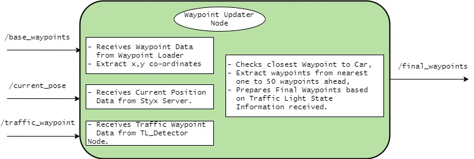
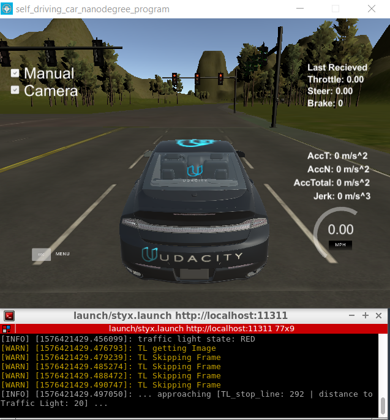
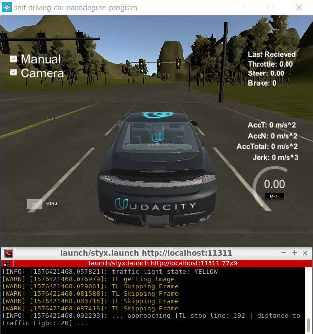
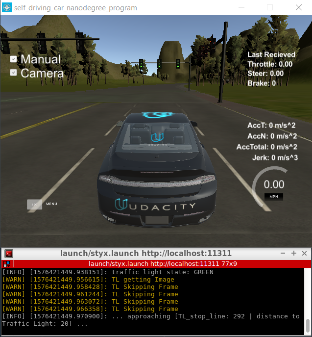

# Udacity - Self-Driving Car Engineer Nanodegree
## Capstone Project: System Integration
[](http://www.udacity.com/drive)

---
####  Notes to Reviewer

| Name 						 | Responsibility  		 			   | Email address                 | 
|:-----------------:		 |:----------:   			   |:----------------------------:	|
| Florian Stahl	(Team Lead)	 | Perception    			   | f.stahl@posteo.de 			|
| Fatemeh Elham Asadi		 | Perception    			   | elham.asadi@horiba-mira.com	|
| Saurabh Sharma	 		 | Path Planning / Integration | saurabh1588sharma@gmail.com	|
| Hiroyuki Mori		 		 | Control  	 			   | m1338m@yahoo.co.jp	|
| Shinya Fujimura	 		 | Control  	 			   | shinya.fujimura@gmail.com		|

---
## Table of Contents
* [Introduction](#introduction)
* [System Architecture](#system-architecture)
	* [Perception Module](#perception-module)
	* [Planning Module](#planning-module)
	* [Control Module](#control-module)
* [Dataset Preparation](#dataset-preparation)
	* [Simulator Data](#simulator-data)
	* [Site Data](#site-data)
* [Traffic Light Classifier](#traffic-light-classifier)
* [Final Integration](#final-integration)
	* [Model Evaluation](#model-evaluation)
* [Challenges Faced](#challenges-faced)
 	* [Latency Issue](#latency-issue)
* [Instructions from Udacity](#instructions-from-udacity)

## Introduction

In the final project of the course we implemented code for a real self-driving car, which drives safely around a track. It recognizes traffic light signals and stops in case a red signal is detected. The system was first tested on a simulator and then on a real car.

For running the system source code we used the virtual machine provided and recommended by Udacity while running the simulator on a Windows 10 host. Check [Section 7](#instructions-from-udacity) for more information.

**Note: Since we experienced strong latency issues with the virtual machine setup, we highly recommend using a native ubuntu installation.**

## System Architecture

The following graphic shows the general system architecture which consists of the three subsystems Perception, Planning and Control, and their connections in a ROS (Robot Operating System) architecture.
* Perception
* Planning
* Control

and their connections in a ROS architecture.


The three parts are described in detail below.

#### Perception Module

##### Overview

The perception subsystem is implemented in `tl_detector.py`. It was designed to classify traffic lights only, since those are the only relevant objects in the simulator and the surrounding during the tests in the real car.

To determine the state of relevant traffic lights, camera images are classified by a CNN model based on the [Tensorflow ObjectDectection API](https://github.com/tensorflow/models/tree/master/research/object_detection).

The module also receives the waypoints (`/base_waypoints`) around the track which the car is supposed to follow. There are eight traffic lights around the track, and the position of their stop lines are provided by a config file from Udacity (`sim_traffic_light_config.yaml`). Taking the cars position into account, the images are assumed to reflect the state of the closest traffic light ahead of the car. The traffic light state then affects the car's controller so that it stops at red lights and starts again when lights switch to green.

###### Subscribed Topics

- `\image_color`: color images from the front-camera within the simulated car
- `\current_pose`: the current position coordinates of our car
- `\base_waypoints`: list of all waypoints for the track

###### Published Topics

- `\traffic_waypoint`: single waypoint of the nearest upcoming red light's stop line 


##### Implementation

Implementation is described [here](https://github.com/FElhamAsadi/CarND-TrafficLightDetection)


#### Planning Module

##### Overview

This module publishes a list of waypoints in front of our car to the topic `/final_waypoints`. The data in waypoints also includes the desired velocity of the car at the given waypoint. If a red traffic light is detected in front of the car, we modify the desired velocity of the `/final_waypoints` up to it in a way that the car slowly stops at the right place.

###### Subscribed Topics

This node subscribes to the topics:
- `/base_waypoints`: list of all waypoints for the track
- `/current_pose`: the current position coordinates of our car
- `/traffic_waypoint`: single waypoint of the nearest upcoming red light's stop line 

###### Published Topics

- `/final_waypoints`: list of waypoints to be follwed by Control Module for driving/

The number of waypoints is defined by the parameter `LOOKAHEAD_WPS`. 
*Note* : Number of waypoints are directly proportional to Lateny



##### Implementation
Refer to the Block Diagram. It uses KD Tree to extract x,y co-ordinates from `/base_waypoints` 


#### Control Module

##### Overview

The vehicle is controlled with DBW (=drive by wire) system, which electronically controls throttle, brake and steering. DBW node  (`dbw_node.py`)  will subscribe to the `/twist_cmd` topic. The node accepts target linear and angular velocities and publishes throttle, brake, and steering commands.

The DBW node outputs can be turned off by a designated flag and the driver can control the car manually. The DBW status can be found by subscribing to `/vehicle/dbw_enabled`.

The inputs to the DBW node are the below topics:

###### Subscribed Topics
* /twist_cmd: Twist commands are published by the waypoint follower node. The DBW node subscribes to this topic and produces the required output in terms of throttle, brake, and steering commands.
* /current_velocity: This is published by the simulator in our case. Then, the DBW node uses it to decide on the linear velocity of the car and provides it to the controller.
* /vehicle/dbw_enabled: This is the status of the DBW. It is published by the simulator in our case. The node will determine whether the brake, throttle and steering are to be published to respective topics or not according to the status.

The outputs from the DBW node are the throttle, brake and steering commands published to the below topics.

###### Published Topics
* /vehicle/throttle_cmd
* /vehicle/brake_cmd
* /vehicle/steering_cmd

##### Implementation

Throttle and brake values are calculated as follows:

1. Apply the low pass filter to the current velocity to reduce noise.
2. Calculate the difference between the current velocity and the target velocity (=vel_error)
3. Calculate the throttle value with the PID controller.
4. If the target velocity and the current velocity are almost 0, set the throttle to zero and apply the maximum braking value.
5. If vel_error is negative and the throttle value is less than 0.1, calculate the brake value by abs(decel) * self.vehicle_mass * self.wheel_radius. Set the deceleration value (=decel) at the maximum of vel_error and the deceleration limit. 

Steering value is calculated as follows:

1. Apply the low pass filter to the current velocity to reduce noise.
2. Pass the linear velocity, the angular velocity and the current velocity to the yaw controller (=self.yaw_controller.get_steering)

For PID and the low pass filter, we chose each parameter as follows.

##### PID
|Kp|Ki|Kd|min|max|
|:---:|:---:|:---:|:---:|:---:|
|0.3|0.1|0.|0.|0.2|

##### Low pass filter
|Tau|Ts|
|:---:|:---:|
|0.5|0.02|


## Traffic Light Classifier

The development of the classifier is described [here](https://github.com/FElhamAsadi/CarND-TrafficLightDetection).


## Final Integration
#### Model Evaluation

The following images show the classification results in the simulated environment for the three given states of the traffic lights. Four frames are skipped due to [latency issues](#latency-issue).






## Challenges Faced
#### Latency Issue 

When turning the camera on in the simulator, we faced a very high latency which led to control failure of the car. The following methods improved the issue slightly, but still did not solve it:
- Processing only every 5th image received
- Activating classifier only when the traffic light waypoints are within 100 unit distance
- Reducing the number of waypoints used to 50


---
## Instructions from Udacity:

This is the project repo for the final project of the Udacity Self-Driving Car Nanodegree: Programming a Real Self-Driving Car. For more information about the project, see the project introduction [here](https://classroom.udacity.com/nanodegrees/nd013/parts/6047fe34-d93c-4f50-8336-b70ef10cb4b2/modules/e1a23b06-329a-4684-a717-ad476f0d8dff/lessons/462c933d-9f24-42d3-8bdc-a08a5fc866e4/concepts/5ab4b122-83e6-436d-850f-9f4d26627fd9).

Please use **one** of the two installation options, either native **or** docker installation.

### Native Installation

* Be sure that your workstation is running Ubuntu 16.04 Xenial Xerus or Ubuntu 14.04 Trusty Tahir. [Ubuntu downloads can be found here](https://www.ubuntu.com/download/desktop).
* If using a Virtual Machine to install Ubuntu, use the following configuration as minimum:
  * 2 CPU
  * 2 GB system memory
  * 25 GB of free hard drive space

  The Udacity provided virtual machine has ROS and Dataspeed DBW already installed, so you can skip the next two steps if you are using this.

* Follow these instructions to install ROS
  * [ROS Kinetic](http://wiki.ros.org/kinetic/Installation/Ubuntu) if you have Ubuntu 16.04.
  * [ROS Indigo](http://wiki.ros.org/indigo/Installation/Ubuntu) if you have Ubuntu 14.04.
* [Dataspeed DBW](https://bitbucket.org/DataspeedInc/dbw_mkz_ros)
  * Use this option to install the SDK on a workstation hthat already has ROS installed: [One Line SDK Install (binary)](https://bitbucket.org/DataspeedInc/dbw_mkz_ros/src/81e63fcc335d7b64139d7482017d6a97b405e250/ROS_SETUP.md?fileviewer=file-view-default)
* Download the [Udacity Simulator](https://github.com/udacity/CarND-Capstone/releases).

### Docker Installation
[Install Docker](https://docs.docker.com/engine/installation/)

Build the docker container
```bash
docker build . -t capstone
```

Run the docker file
```bash
docker run -p 4567:4567 -v $PWD:/capstone -v /tmp/log:/root/.ros/ --rm -it capstone
```

### Port Forwarding
To set up port forwarding, please refer to the "uWebSocketIO Starter Guide" found in the classroom (see Extended Kalman Filter Project lesson).

### Usage

1. Clone the project repository
```bash
git clone https://github.com/udacity/CarND-Capstone.git
```

2. Install python dependencies
```bash
cd CarND-Capstone
pip install -r requirements.txt
```
3. Make and run styx
```bash
cd ros
catkin_make
source devel/setup.sh
roslaunch launch/styx.launch
```
4. Run the simulator

### Real world testing
1. Download [training bag](https://s3-us-west-1.amazonaws.com/udacity-selfdrivingcar/traffic_light_bag_file.zip) that was recorded on the Udacity self-driving car.
2. Unzip the file
```bash
unzip traffic_light_bag_file.zip
```
3. Play the bag file
```bash
rosbag play -l traffic_light_bag_file/traffic_light_training.bag
```
4. Launch your project in site mode
```bash
cd CarND-Capstone/ros
roslaunch launch/site.launch
```
5. Confirm that traffic light detection works on real life images

### Other library/driver information
Outside of `requirements.txt`, here is information on other driver/library versions used in the simulator and Carla:

Specific to these libraries, the simulator grader and Carla use the following:

|        | Simulator | Carla  |
| :-----------: |:-------------:| :-----:|
| Nvidia driver | 384.130 | 384.130 |
| CUDA | 8.0.61 | 8.0.61 |
| cuDNN | 6.0.21 | 6.0.21 |
| TensorRT | N/A | N/A |
| OpenCV | 3.2.0-dev | 2.4.8 |
| OpenMP | N/A | N/A |

We are working on a fix to line up the OpenCV versions between the two.
